<p align="center">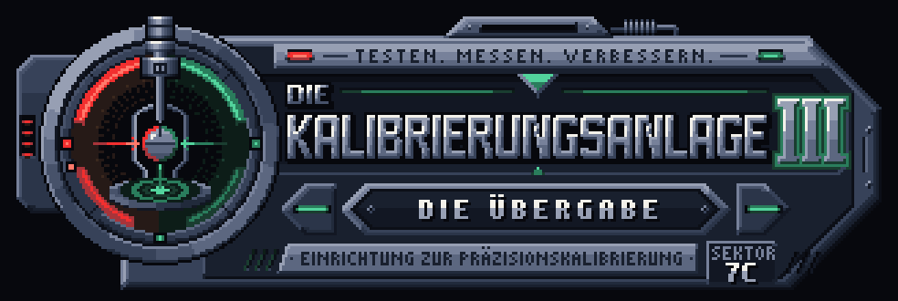</p>

# Die Kalibrierungsanlage III — Kapitel 0: NULLSIGNAL

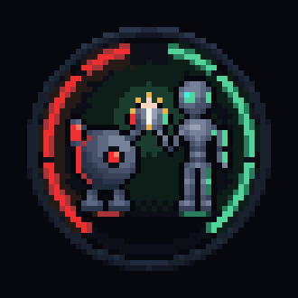

**Team_Aperture · Prototyp 0.1** — a browser-based **2.5D pixel-art adventure**, and the technical and artistic foundation for the third *Kalibrierungsanlage* game.

Chapter 0 is a **non-canonical vertical slice**. It demonstrates the full loop — explore, inspect, collect, operate machinery, solve a puzzle, watch the facility respond, move on — without establishing the actual KA-III story. All in-game text is German.

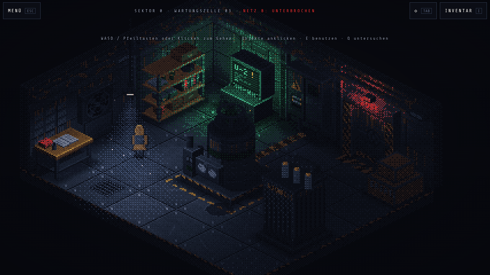

*Everything in the image is code: a locked 28-colour palette, Bayer 8×8 dithering, baked per-pixel light, 2:1 isometric projection. No image files.*

## Play

```bash
npm install
npm run dev        # http://localhost:5173/kalibrierungsanlage-iii/
```

Production build and local preview (identical to GitHub Pages):

```bash
npm run build      # type check + static build into dist/
npm run preview    # http://localhost:4173/kalibrierungsanlage-iii/
```

No backend: the game is a static site. Progress and settings are stored in `localStorage`.

### Controls

| | Desktop | Touch |
| --- | --- | --- |
| Walk | WASD / arrow keys, or click the floor | Tap the floor (optional virtual joystick in *Einstellungen*) |
| Use / interact | Click an object, or **E** / Enter / Space | Tap an object |
| Inspect | Right click, or **Q** | Long press |
| Inventory | **I** | *Inventar* button / item strip (portrait) |
| Highlight objects | **Tab** | ◇ button |
| Pause | **Esc** | *Menü* button |
| Puzzle tiles | Click, right click = back; arrows + Enter, Shift+Enter / R = back; **H** hint, **U** undo | Tap, long press = back |

## Chapter 0 at a glance (spoilers)

1. **Das Erwachen** — darkness, a mechanical sound, an indicator light. Then a terminal flickers on, shows its manufacturer's Team_Aperture emblem, and reports *SYSTEMSTATUS: UNBEKANNT*. The camera reveals the room. Control arrives about 12 s after *Neues Spiel* (shorter with *Bewegung reduzieren*).
2. **Die Wartungszelle** — terminal T-01 reports that Netz B is down, fuse F3 is missing and the conduit path is open. Shelf R-2 holds the fuse. The room also has a workbench with a logbook, scratched tally marks, a fan that turns without power, a flickering lamp, the machine *Messwerk M-3*, and transformer TR-1, which you can walk behind.
3. **Puzzle 01 — Der Energiepfad** — a 3×3 conduit matrix in distribution panel V-2 with a welded middle segment and a burnt segment that must stay dead. Three-stage hints, undo, reset, and full keyboard and touch support.
4. **Response** — the lights strike and strobe on, the machine starts, and the door lamp goes red → amber → green. The bolts retract and the bulkhead lifts while the camera pans to it.
5. **Hinter der Schleuse** — an observation walkway above a deep machine hall, with pistons, a giant fan and foreground I-beams. A dead lattice gate is opened with a hand crank from locker 3.
6. **Nullsignal** — terminal T-07 wakes on its own: an incoming signal on channel 0, source not attributable. The hall goes silent. *KAPITEL 0 ABGESCHLOSSEN · DIE KALIBRIERUNGSANLAGE III*, then *Erneut spielen* or *Hauptmenü*.

A curious playthrough (reading terminals, the logbook and the shift log, inspecting everything) is designed for roughly 12–18 minutes; this is an estimate, not a measured play test. The automated end-to-end playthrough, which knows the solution, takes under 2 minutes.

| | |
| --- | --- |
| 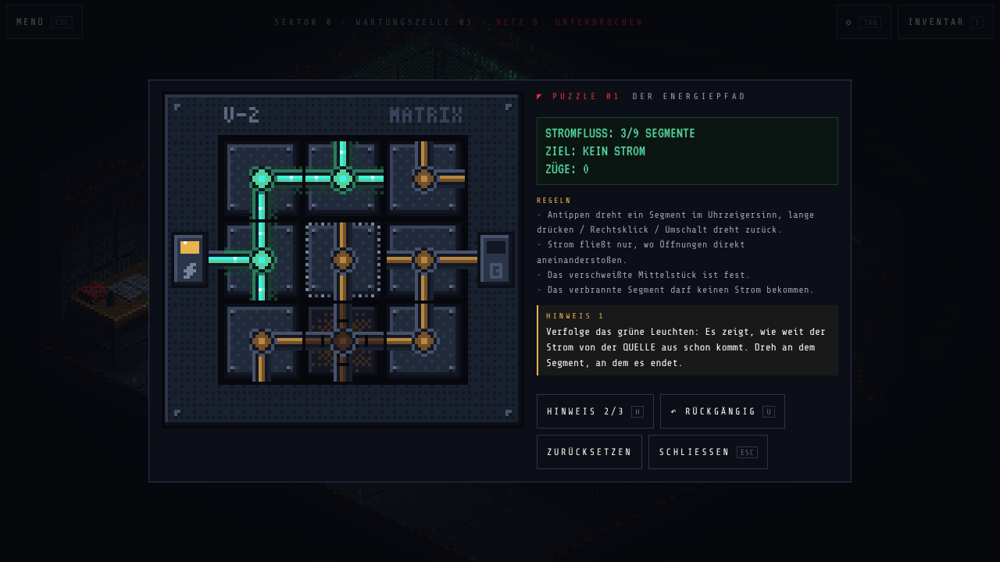 | 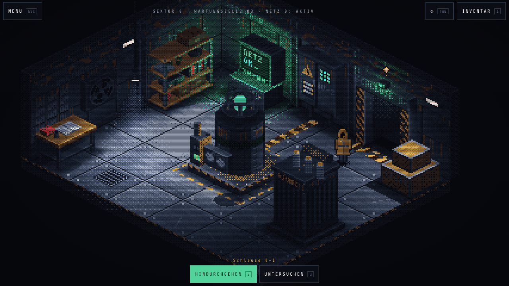 |
| 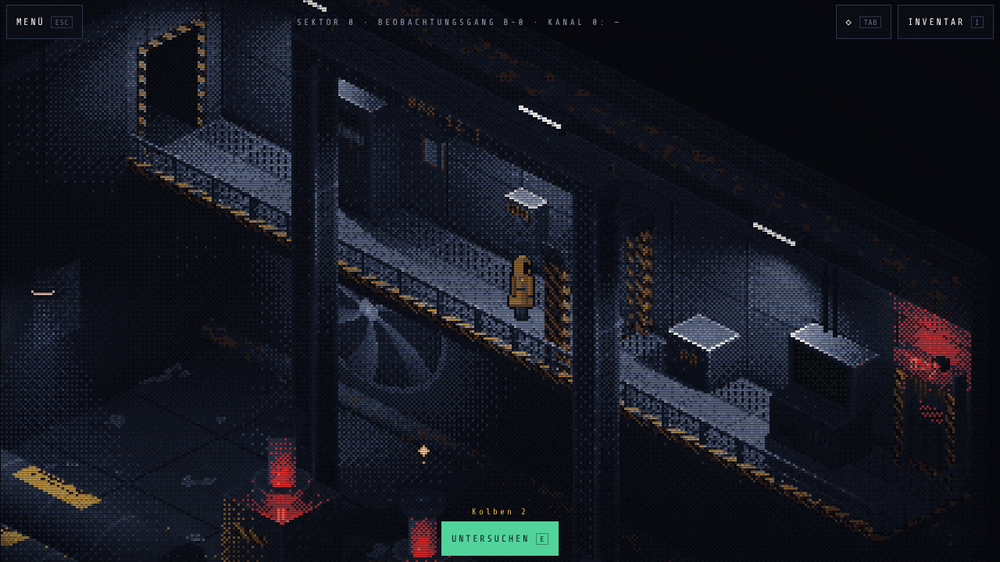 | 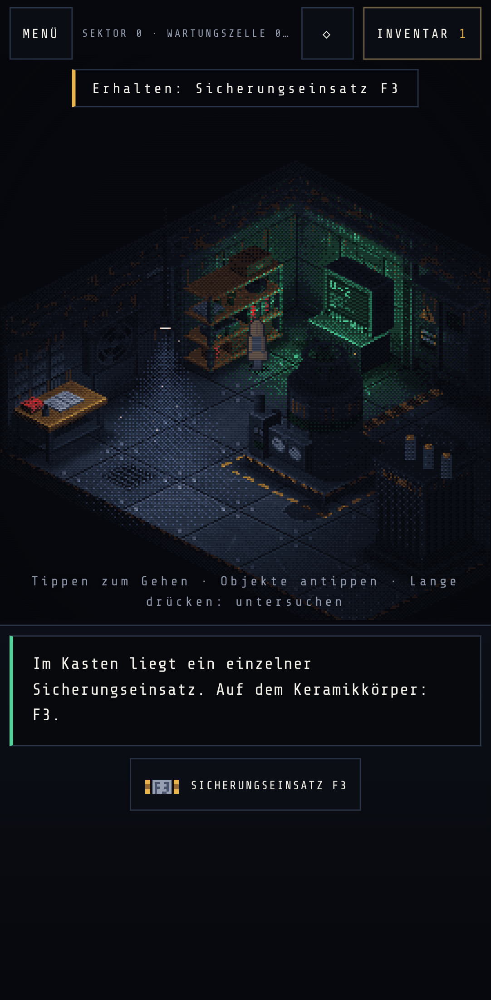 |

## Branding

The Team_Aperture emblem (a small red robot and a taller green robot high-fiving inside a red/green ring) and the KA-III banner are pixel art generated from the same 28-colour palette as the game. There is a reusable logo system with four emblem sizes (full, simple, screen, badge), subtle light animation and a CRT boot reveal. The marks appear on:

- the boot screen, title screen, menus, HUD, favicon and ending;
- in the world, on terminals T-01 and T-07, a painted mural in the machine hall, and crate stickers.

Details: **[docs/BRANDING.md](docs/BRANDING.md)**.

| | |
| --- | --- |
| 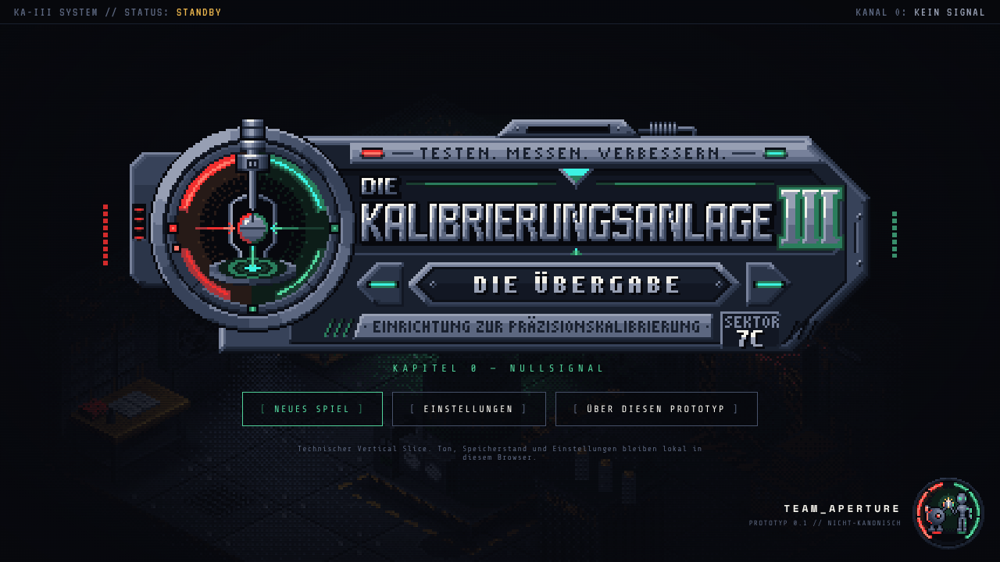 | 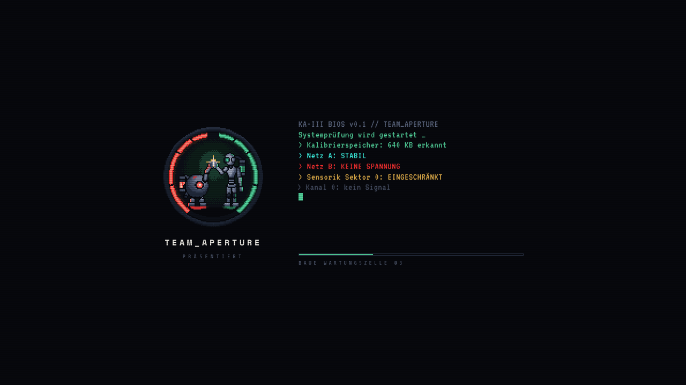 |
| 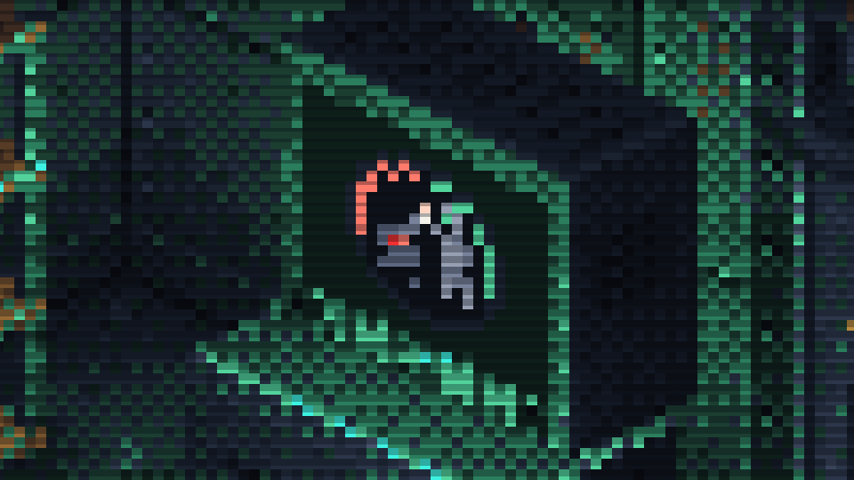 | 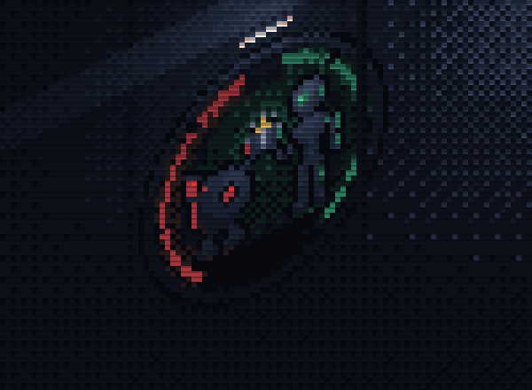 |

## Tests

```bash
npm test           # unit tests (Vitest): projection, depth sort, collision, A*, puzzle state space, saves, room reachability
npm run test:e2e   # browser tests (Playwright) against the production build
```

The end-to-end suite builds the site, serves it with `vite preview` and plays it in Chromium on four profiles: desktop 1280×720, laptop 1366×768, Pixel 7 portrait and Pixel 7 landscape. It covers:

- **Full playthroughs** with mouse + keyboard and with touch only.
- **Movement**: all directions, walls, rapid retargeting, unreachable targets.
- **Inspection and the inventory**, including "Benutzen mit …".
- **The puzzle**: short circuit, undo, reset, welded tile, keyboard control and hints.
- **Saving and reloading** mid-puzzle, after the door opens and after the room change.
- **Ending and replay**.
- **Systems**: pause, settings persistence, corrupt and incompatible saves, live resizing and orientation, reduced motion, and the Canvas renderer fallback.
- **Layout checks**: no page scrolling, integer pixel scaling, touch targets at least 44 CSS px.

In this container the browser binary is preinstalled; elsewhere run `npx playwright install chromium` first.

## Performance

Measured in this container's headless Chromium, which renders with software GL (SwiftShader), so real devices are faster:

| | Boot (bake all textures) | Game logic per frame |
| --- | --- | --- |
| Desktop 1280×720 | ≈ 2.1 s | ≈ 0.03 ms |
| Pixel 7 emulation, CPU throttled 4× | ≈ 5.3 s | ≈ 0.05 ms |

With software compositing, the full-screen CRT overlay costs about a third of the frame rate. So the game watches the first seconds of play and switches to **Leistungsmodus** (no CRT overlay, fewer particles) if it drops below 40 fps. The setting can be changed in *Einstellungen*. With GPU compositing the overlay should be cheap, but this has not been measured on physical devices.

## Deployment (GitHub Pages)

`vite.config.ts` uses the base path `/kalibrierungsanlage-iii/` in every mode, and all asset URLs are relative to it.

1. Push to `main`.
2. In the repository settings, go to **Pages → Build and deployment → Source** and choose **GitHub Actions**.
3. `.github/workflows/deploy.yml` runs the type check, unit tests and build, then publishes `dist/`.

The site is served at `https://<owner>.github.io/kalibrierungsanlage-iii/`. Any other static host works too: upload `dist/` into a folder called `kalibrierungsanlage-iii`.

## Project structure

```
src/core      pure engine math (projection, depth sort, collision, nav grid)
src/art       procedural pixel-art pipeline (G-buffer, baked lighting, Bayer dithering, overlays, player sprite)
src/art/brand Team_Aperture emblem + KA-III banner (logo system, animation, decals, monitor rasters)
src/content   layouts, item texts, hint texts
src/game      app, scenes, rooms (verbs + German texts + scripts), player, puzzle logic, input
src/state     save data, validation/normalisation, settings
src/ui        HTML/CSS interface (HUD, dialogue, menus, inventory, terminal, puzzle panel)
src/audio     synthesized WebAudio sound
tests/unit    Vitest
tests/e2e     Playwright
docs          architecture notes and screenshots
```

See **[docs/ARCHITECTURE.md](docs/ARCHITECTURE.md)** for the rendering decisions, the systems, and a step-by-step guide to adding rooms and chapters.

## Credits and licences

- Code, art and sound are generated in this repository by Team_Aperture's prototype.
- The Team_Aperture emblem and the KA-III logo are Team_Aperture's own marks, redrawn here as pixel art. They are not Portal / Aperture Science branding.
- Fonts: Share Tech Mono, Space Mono and VT323 (SIL Open Font License), bundled via Fontsource.
- Engine: Phaser 3 (MIT).
