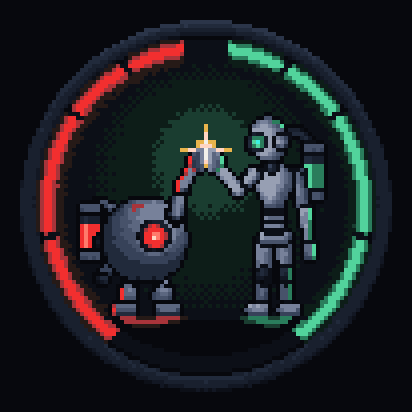

# Branding: Team_Aperture × KA-III

The visual identity of *Die Kalibrierungsanlage III* rests on two marks:

| Mark | What it is | Where it appears |
| --- | --- | --- |
| **Team_Aperture emblem** | The studio logo. A circular emblem, red on the left and green on the right. A small robot with a red eye and a taller robot with a green eye high-five at the top centre. | Boot splash, title screen, about panel, pause menu, HUD, favicon, ending credit, terminal reader, in-world monitors, stickers, the hall mural |
| **KA-III banner** | The game logo: *DIE KALIBRIERUNGSANLAGE III — DIE ÜBERGABE* | Title screen hero, ending |

Both are pixel art generated by code from the game's locked 28-colour palette, like everything else in the game. The repository contains no logo image files. The PNGs in `docs/brand/` are exports for documentation and are regenerated with `npm run brand`.

> **Not Portal branding.** The emblem is our own mark. The ring is a plain bezel with arc light segments, with no iris, shutter blades or Aperture Science wordmark. Keep it that way when editing.

## The logo system (`src/art/brand/`)

| File | Role |
| --- | --- |
| `emblem.ts` | `emblemPixels(variant, {red, green, spark})` returns palette indices. It has no imports, so Node scripts can load it directly. |
| `banner.ts` | `bannerPixels({red, green})`: the KA-III banner (`BANNER_W × BANNER_H`). |
| `fx.ts` | Palette-safe effects: `UP`/`DOWN` ramp steps, the CRT `bootFrame(px, p)` reveal, `scanlines`. |
| `index.ts` | The public API: `emblem()`, `banner()`, `emblemBoot()` (cached), the `brandPulse(ms)` light clock, `paint()`, `dataUrl()`, `installFavicon()`. |
| `decal.ts` | `emblemDecal(frag, opts)`: paints the emblem into baked world art (lit paint, wear, optional luminous arcs). |
| `screens.ts` | `drawScreenEmblem(raster, w, h, {ms, boot})`: the badge on in-world monitor rasters. |
| `src/ui/brand.ts` | DOM components `emblemMark(variant, opts)` and `bannerMark(opts)`. They are scaled with nearest-neighbour filtering and animated by one shared ticker. |

### Variants

| Variant | Size | Use |
| --- | --- | --- |
| `full` | 96 px | Boot splash, docs. Shown at 2–4×. |
| `simple` | 48 px | Title-screen studio mark, about panel, ending credit, the hall mural. |
| `screen` | 32 px | CRT / monitor version: high contrast, readable under scanlines. Used for the short boot. |
| `badge` | 15 × 15 px | Favicon, HUD status line, pause menu, terminal reader, T-01 and T-07 screens, crate stickers. |

### Animation

`brandPulse(ms)` drives every mark, and the values are quantised to 4 levels so the rasters can be cached:

- **Red and green breathe in turns** (period 5.2 s). The pulse steps the ring segments, eyes and floor glow up one ramp level. It never introduces new colours.
- **The high-five sparks** once per period, at the moment the two halves cross: a fast rise (~90 ms) and a slow decay (~520 ms).
- **Monitor marks boot like a CRT** (`bootFrame`): a beam line opens from the centre, the picture rolls open over-exposed, a scan bar passes, then one short dip.
- With *Bewegung reduzieren* (or `prefers-reduced-motion`), every mark shows a fixed resting state and skips the boot reveal.

A mark redraws its canvas only when its quantised state changes. A screen full of logos therefore costs a handful of small canvas uploads per second.

## Where it is used

### Boot and title screen (after the KA-II menu)

- **Boot screen** (`src/ui/boot.ts`): the loader is dressed as the facility BIOS. The Team_Aperture emblem powers on like a CRT ("TEAM_APERTURE / PRÄSENTIERT") while system lines appear. The bar underneath is the real texture-bake progress, so the boot adds almost no waiting. The full boot runs once per browser session; after that, and with reduced motion, a short variant runs.
- **Title screen** (`mainMenu` in `src/ui/menus.ts`), structured like the KA-II menu:
  - a system bar whose status goes OFFLINE → STANDBY, with *KANAL 0* on the right;
  - the KA-III banner, scaled to whole device pixels, between a red LED bar on the left and a green one on the right, with a breathing glow and a stepped scan bar every 9 s;
  - bracket buttons `[ NEUES SPIEL ]`;
  - an idle remark from SYSTEM on large screens;
  - the Team_Aperture studio mark in the corner.

### In the world

| Place | Mark | Behaviour |
| --- | --- | --- |
| T-01, Wartungszelle | badge on the CRT | Boots with the emblem in the intro (manufacturer splash) before *SYSTEMSTATUS: UNBEKANNT*. Once power is restored, it alternates every 9 s between *NETZ OK* and the emblem, re-syncing each time. |
| T-07, Beobachtungsgang | badge on the CRT | Wakes on its own: static, then the emblem rolls in, then the signal. |
| Hall wall, left of the entrance | `simple`, 48 px, painted | Worn paint that shears with the wall. The red and green arcs and the eyes are luminous paint (emissive), so they keep glowing when the hall goes dark at the end. Inspectable as *Wandbild*. |
| Crates (both rooms) | badge sticker | Lit with the room, slightly worn. |

### Interface

The badge also appears in the HUD status line (landscape), the pause menu header, and the terminal reader bar, where it boots each time a terminal opens. The ending shows the KA-III banner and an "Ein Prototyp von Team_Aperture" credit, with the emblem booting in.

## Editing the marks

1. Edit `src/art/brand/emblem.ts` or `banner.ts`. They contain only palette indices 0–27 and 255 (transparent).
2. `npm test`: `tests/unit/brand.test.ts` checks sizes, palette use, transparent corners, and the identity rule (red mass on the left, green on the right). It also checks that the pulse stays subtle and that the boot frames stay on the palette.
3. `npm run brand` regenerates `docs/brand/*.png` and the static SVG favicon in `index.html`. At runtime the favicon is replaced by the canvas-rendered badge.
